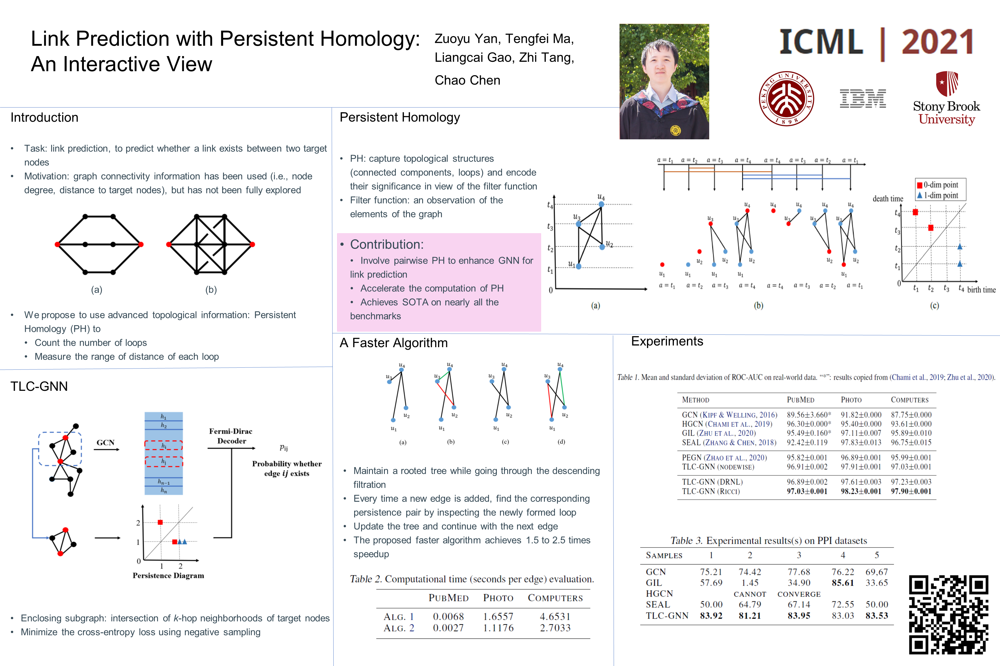
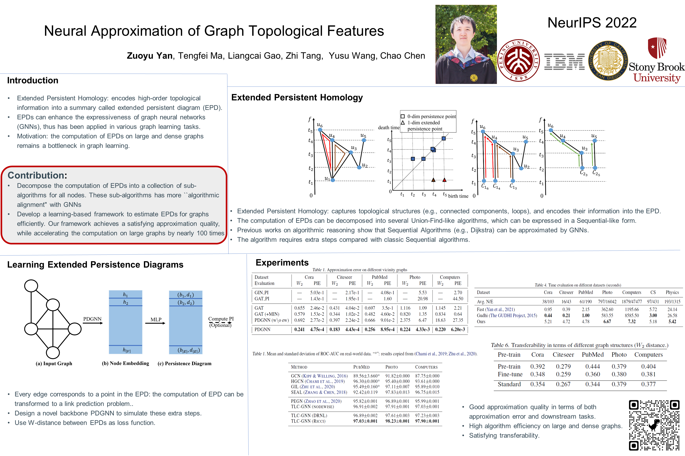

# TLC-GNN \& PDGNN

Implementation for paper [Link Prediction with Persistent Homology: An Interactive View](https://arxiv.org/abs/2102.10255) (ICML 2021, TLC-GNN) and for paper [Neural Approximation of Graph Topological Features](https://arxiv.org/pdf/2201.12032.pdf) (NeurIPS 2022, PDGNN)


## Requirements

Python version is 3.7, and the versions of needed packages are listed in requirements.txt

We also provide a packed environment, which is available at:

[curvGN.tar.gz](https://drive.google.com/file/d/1RXz8sl7UETsalWDZwZZIkolf9glzQXoP/view?usp=share_link)

you can activate the environment with:

```
tar -xzf curvGN.tar.gz -C curvGN
source curvGN/bin/activate
```


## Run experiments for TLC-GNN

```
python pipelines.py
```

to run the experiments for PubMed, Photo and Computers datasets, the results will be stored in ./scores.

If you want to run experiments for PPI datasets, you can comment out line 56 in pipelines.py.


## Setup Cython

```
cd ./sg2dgm
python setup_PI.py build_ext --inplace
```

to setup ./sg2dgm/persistenceImager.pyx

If the command does not work, a substitute solution is to copy the code in ./sg2dgm/persistenceImager.pyx to a new file named ./sg2dgm/persistenceImager.py, this might also work.


## Run experiments for PDGNN

A small note: PDGNN has nothing to do with knowledge distillation, actually. 

First generate the training data for node-centered vicinity graphs:

```
python ./Knowledge_Distillation/data_utils_NC.py
```

You can also generate edge-centered vicinity graphs / total graphs using 

```
python ./Knowledge_Distillation/data_utils_LP.py 
python ./Knowledge_Distillation/data_utils_GC.py
```

Then train PDGNN, notice that the saved data dir need to be revised in lines15-26 in ./Knowledge_Distillation/train_Teacher_Model.py.

Notice that in the code, PDGNN is actually in ./Knowledge_Distillation/gat_conv.py rather than ./Knowledge_Distillation/PD_conv.py

```
python ./Knowledge_Distillation/train_Teacher_Model.py
```

You can also train PDGNN on TUdatasets, ZINC, and OGBG-HIV

```
python ./Knowledge_Distillation/train_Teacher_Model_GC.py
```

Afther training PDGNN, your can run downstream node classification/link prediction tasks with 

```
python pipelines_GIN.py
python pipelines_LP_GIN.py
```


## Poster

### TLC-GNN




### PDGNN

